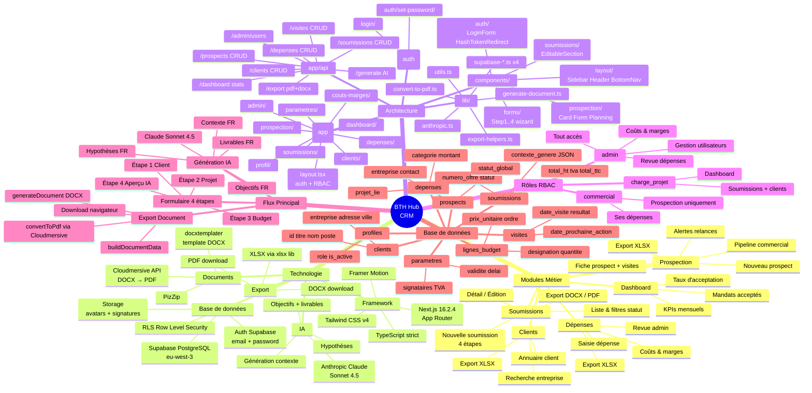
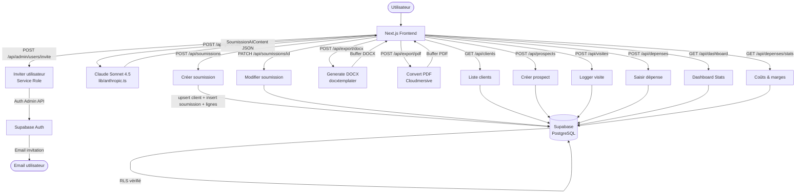
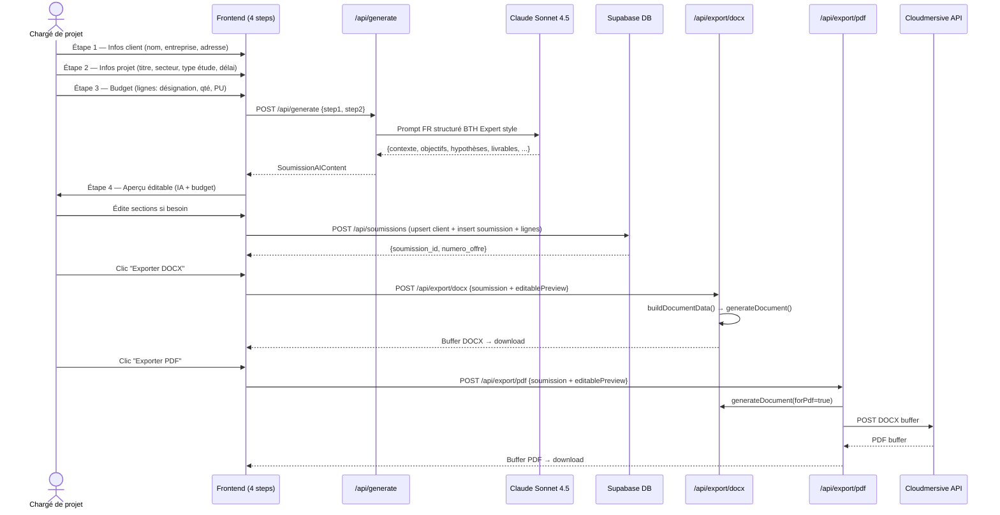

# BTH Hub — CRM BTH Expert · Documentation Architecture

## Mindmap Mermaid

---

## Architecture — Vue textuelle pour entrevue

### Présentation en 3 phrases

**BTH Hub** est un CRM interne pour BTH Expert, cabinet de conseil en environnement algérien. Il permet de gérer le cycle complet d'une offre commerciale : de la prospection terrain jusqu'à la génération automatique du document de soumission professionnel en DOCX/PDF, avec rédaction assistée par IA (Claude). L'application est construite sur Next.js App Router + Supabase + Tailwind, déployable sur Vercel.

---

## Routes API — Diagramme de flux

---

## Flux bout-en-bout — Génération de soumission

---

## Composants React — Référence rapide

| Composant | Rôle | Props clés | Client/Server | Communication |
|-----------|------|-----------|---------------|---------------|
| `Sidebar` | Navigation principale filtrée par rôle | `role`, `pathname` | Client (animations, pathname) | Lit le profil depuis layout |
| `Header` | Barre top — user dropdown, alertes, déconnexion | `user`, `alertsCount` | Client (onClick, dropdown) | Fetch `/api/prospects/alerts` |
| `BottomNav` | Navigation mobile — miroir Sidebar | `role` | Client (pathname) | — |
| `LoginForm` | Formulaire email/password Supabase | — | Client (form state) | `supabase-browser.ts` signIn |
| `HashTokenRedirect` | Extrait token Supabase depuis URL hash | — | Client (window.location) | Supabase session |
| `StepClientInfo` | Étape 1 wizard — données client | `data`, `onChange` | Client (form) | État remonté au wizard parent |
| `StepProjectInfo` | Étape 2 wizard — données projet | `data`, `onChange` | Client (form) | État remonté au wizard parent |
| `StepBudget` | Étape 3 wizard — lignes budget | `lignes`, `onChange` | Client (drag/sort) | État remonté + `calcTotaux()` |
| `StepPreview` | Étape 4 wizard — aperçu IA éditable | `preview`, `soumission` | Client (édition inline) | `POST /api/generate`, `POST /api/soumissions` |
| `EditableSection` | Bloc texte éditable en place | `value`, `onChange`, `label` | Client (textarea focus) | Callback onChange vers StepPreview |
| `ProspectCard` | Carte prospect dans le pipeline | `prospect` | Probablement Server | Lien vers `/prospection/[id]` |
| `VisiteForm` | Formulaire log de visite | `prospectId`, `onSuccess` | Client (form submit) | `POST /api/visites` |
| `PlanningZone` | Zone planification prochaine action | `prospect` | Client (interactions) | `PATCH /api/prospects/[id]` |
